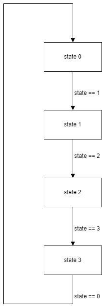
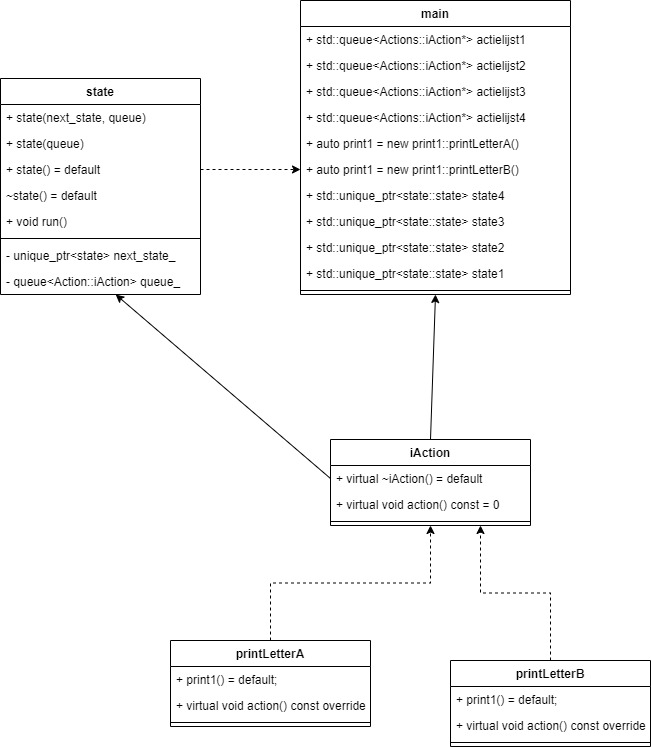

# State machines 101

---
Auteurs:
 - Twan Wieggers (514012) 
 - Wouter Denkers (514501)
---
Klas:
  - ETI2V.A
---

## Inleiding
Voor het vak Advanced Programming Concepts is de opdracht gegeven om een naar verschillende onderwerpen onderzoek te doen. 
Hiervoor was een lijst beschikbaar gesteld met 13 verschillende opdrachten gericht op verschillende technische programmeer onderwerpen. 
Dit project kon uitgevoerd worden in groepjes van 2. 
Uit de lijst van opdracht is er gekozen om de opdracht “Patterns: state machines 101” te onderzoeken. 
Op basis van deze vraag is er een hoofdvraag opgesteld en vanuit daar doelstellingen die moeten helpen het uitwerken van de hoofdvraag. 
Verder zal het verslag op chronologische volgorde geschreven worden dus zal er begonnen worden met de basis en eindigen met een uitgebreide/diepgaande versie van de hoofdvraag. 

### Hoofdvraag
Als hoofdvraag hebben we gekozen voor “Wat is een abstracte makkelijk uitwisselbare state machine”, 
Hiervoor moet er dus duidelijk uitgezocht worden hoe een state machine werkt en alles wat daarom heen bij komt kijken zoals abstractie, 
algoritmes en een stukje geschiedenis en toepassing. 
Aan het eind van de report/onderzoek is het doel dat er een duidelijk beeld is gekomen over state machines en de hoofdvraag hierbij beantwoord kan worden. 
Op basis van dit verslag zal een ook een presentatie gehouden worden met een eventueel embeded system als demo model.


## Doelstelling
1.	Wat is een state machine?
2.	Hoe is een state machine ontstaan?
3.	Wanneer is het makkelijk uitwisselbaar(abstract)?
4.	Wat en wanneer valt iets onder een state?
5.	Wat is en wanneer is een state abstract?
6.	Welke soorten state machines zijn er?
7.	Hoe (welke datastructuren, enz) representeer je een state machine in code?
8.	Voor welke soort problemen vormt een state machine een oplossing?

## Inhoud
Een statemachine is een wiskundig model. 
Dit wiskundig model bestaat uit meerdere states. 
Dit houdt in dat er verschillende fases zijn. Voor elk van deze fases is er een state en een overgang. 
Om over te gaan van de ene state naar een andere state heb je overgangsvoorwaarde. 
Denk hierbij aan bijvoorbeeld het aanzetten van een lamp. Dit is namelijk de makkelijkste statemachine die er is. 
Wanneer de lamp uit staat en de knop wordt ingedrukt moet de lamp aangaan. 
De state is dan het aanzetten van de lamp en de overgangsvoorwaarde was dan het indrukken van de knop.

In 1956 is door Edward Moore de eerste state machine geïntroduceerd. 
Deze state machine is ontworpen met de gedachte erachter dat een state ook een output kan geven. 
Deze state machine is ook wel de Moore Machine genoemd en was hiermee de eerste van zijn tijd. 
Een state machine die hierna kwam de Mealy Machine. 
Deze state machine heeft per state meerdere opties. 
Hierdoor kan deze bijvoorbeeld wanneer de overgangswaarde 1 moet zijn maar de 0 is naar een andere state toe gaan.

Om het makkelijker uitwisselbaar te maken maak je gebruik van abstract. 
Dit abstract betekent eigenlijk dat er geen vaste definitie aanzit. 
Dit zorgt ervoor dat alles makkelijk uitwisselbaar wordt. 
Een goed voorbeeld hiervan is bij een functie een andere functie meegeven in plaats van een vaste waarde mee geeft.

Een state is fase in een state machine waarin alles wordt uitgevoerd. 
Zoals hierboven ook al was verteld wanneer je een lamp aan doet is de overgangsfase het bedienen van de knop maar de state zelf is dan het moment wanneer de lamp echt aan wordt gedaan. 
Hierdoor geeft de state dan een output waarmee de lamp aan kan.

Een state wordt abstract als er niet direct bij gekomen kan worden. 
Als je wel bij deze state kan via een andere state is deze abstract. 

Er zijn 2 soorten state machines:
- Deterministic State Machine: dit is een state machine die wanneer er niet voldaan is aan de overgangsvoorwaarde een andere state kiest. Dit is goed te zien in figuur X. Dit is ook een Mealy Machine. 
\

- Non-Deterministic State Machine: dit is een state machine die blijft hangen in zijn state zolang er niet wordt voldaan aan de overgangsvoorwaarde. Dit is een voorbeeld van Moore Machine en is goed te zien in figuur X. 
\


## Voorbeelden
Er zijn verschillende mogelijkheden om een state machine te gebruiken daarom zullen hieronder enkele voorbeelden geplaatst 
worden van simpele state machines tot uitgebreidere statemachines.
Alle voorbeelden zijn op basis van de volgende flowchart gemaakt in c++ code de acties zijn niet meegenomen hiervoor is een comment geplaatst. 
Hier kan vervolgens iemand de desbetreffende acties plaatsen die bij deze states uitgevoerd moeten worden.
\


#### Basic statemachine
Om te beginnen is kan je door middel van statemachines if/else statements door de verschillende stappen heen. 
In het voorbeeld in figuur X kan je zien hoe een output aangezet wordt op basis van zijn huidige state en de aan schakelaar. 
En vervolgens uitgezet kan worden indien de lamp aan is door een andere ingang de uit schakelaar.
```c++
int state = 0;

int main()
{
    if(state == 0)
    {
        //voer de actie van deze state uit
        state == 1
    }else if(state == 1)
    {
        //voer de actie van deze state uit
        state == 2;
    }else if(state == 2)
    {
        //voer de actie van deze state uit
        state == 3;
    }else if(state == 3)
    {
        //voer de actie van deze state uit
        //dit is de laatste state en opnieuw te beginnen kan je weer state == 0 zeggen.
        state == 0;
    }
}
```

#### Switch statemachine
In plaats dat de state bijgehouden met if/else statement kan hiervoor ook een switch case systeem gebruikt worden in figuur X is dus het zelfde voorbeeld te zien als bij de if/else statement maar dan doormiddel van switch case statemachine. 
Hierdoor is meteen te zien dat het een stuk overzichtelijker is maar ook stuk makkelijker om bijvoorbeeld een nieuwe extra state toe te voegen. 
Op deze manier is het al een stukje in de implementatie.

```c++
int state = 0;

int main()
{
    switch(state) {
        case 0:
            //voer de actie van deze state uit
            state == 1;
            break;
        case 1:
            //voer de actie van deze state uit
            state == 2;
            break;
        case 2:
            //voer de actie van deze state uit
            state == 3;
            break;
        case 3:
            //voer de actie van deze state uit
            //de state wordt weer naar 0 gezet om zo opnieuw te beginnen.
            state == 0;
            break;
    }
}
```
#### Enumeration statemachine
Dit is een statemachine die enigszins op de switch case statemachine lijkt. 
Echter heeft deze als voordeel dat de verschillende states in de enumeration variable zitten dus overal gebruikt kan worden.

```c++
enum State
{
  STATE,
  STATE1,
  STATE2
};

int state = 0;
int main()
{
    switch(State_) {
        case STATE:
            //voer de actie van deze state uit
            state_ == STATE1;
            break;
        case STATE1:
            //voer de actie van deze state uit
            state_ == STATE2;
            break;
        case STATE2:
            //voer de actie van deze state uit
            state_ == STATE;
            break;
    }
}
```

## Ons programma
Nu we eerst onderzoek gedaan hebben na verschillende statemachines hebben we vervolgens zelf ons eigen systeem gemaakt zelf hadden we enkele eisen wat ons interressant leek en dat was vooral gebasseerd op het niet herproduceren van code. 
Dus als voorbeeld stel je wilt een lampje in meerdere states aan zetten dan kan je 1 klasse maken en deze vervolgens in de verschillende states toevoegen. Dus op deze manier kan de zelfde stuk code meerdere keren uitgevoerd worden in de gemaakte state machine.
Verder wouden we dat we meerdere acties konden toevoegen aan een bepaalde state en vanuit hier kwamen uit op een queue principe omdat dit op basis van FIFO werkt.
Dus als je in een bepaalde state zit voert die dus de gehele actie lijst uit. Verder is het in onze implementatie ook mogelijk om een bepaalde actie lijst dan weer te her gebruiken in de code zodat je dit niet meer opnieuw hoeft te schrijven.
Verder heeft elke state een next state waar de volgende state heen wijst dus stel de 1e state is klaar dan zal deze automatisch naar de 2e state gaan.

### UML
Om te beginnen hebben we eerst een UML gemaakt waar we het programma hebben uitgewerkt hoe we het wouden aanpakken. 
Omdat de acties natuurlijk allemaal losse bestanden zijn hebben we in de UML maar 2 files gemaakt. 
Dit omdat het eigenlijk allemaal op hetzelfde principe werkt en anders de UML zeer groot word met alle mogelijke acties als losse klasses.
\


### Code
We leggen hier niet de gehele code uit maar willen vooral een voorbeeld geven van de implementatie van de functies zodat een bepaalde flow van een programma geimplementeerd kan worden met ons gemaakte systeem.
Als voorbeeld hebben wij in de console een bepaalde zin laten printen en dat in elke state een woord word geprint op basis van die bepaalde actie lijst. Verder zit tussen elke staat een actie lijst die her gebruikt word om de spatie toegevoegd dus dan je kan zien dat ook bepaalde states her gebruikt kunnen worden. 

```c++
int main() 
{
    
    
    return 0;
}
```

## Toepassing
De statemachine wordt in veel dingen toegepast overal gedurende je dag kom je dingen tegen die op basis van states werken een simpel voorbeeld is bijvoorbeeld een schakelaar van een lamp.
Het is een simpel systeem maar bestaat alsnog uit verschillende states zoals een “aan state” en een “uit state”.
En deze stages worden bijvoorbeeld getriggerd door een schakelaar wat bijvoorbeeld ook in states kan werken voor de “press state”, “hold state”, “release state”.
Dus zoals te zien is kan een simpel iets als een lamp schakelen uit meerdere states bestaan. Dus daarom is het belangrijk om een eenvoudig systeem te hebben waar het makkelijk is om states toevoegen en te hergebruiken in de code.
Ons gemaakte systeem zou hierin eventueel een uitweg kunnen zijn voor mensen die naar een oplossing zoeken voor het gestructureerd schrijven van processen waar states een belangrijke rol spelen.
Echter is het natuurlijk nooit volledig af zo zou je eventueel de volgende dingen kunnen implementeren om het huidige systeem te verbeteren: op dit moment kan een state nog niet worden hergebruikt omdat er een probleem is met naar een andere state linken.
Hiervoor zou dan een methode moeten worden ontwikkeld die deze state kan kopieren inplaats van de pointer mee geeft dus de gehele lijst met states. Verder is het programma nog niet voorzien van inputs dit kan ook gelinked worden aan een state. Dit kan gedaan worden door middel van een event systeem die dan toegevoegd kan worden aan het programma.

## Bibliografie
https://www.itemis.com/en/yakindu/state-machine/documentation/user-guide/overview_what_are_state_machines
\
https://en.wikipedia.org/wiki/Finite-state_machine
\
https://en.wikipedia.org/wiki/Model_of_computation
\
https://en.wikipedia.org/wiki/Moore_machine
\
https://developer.mozilla.org/en-US/docs/Glossary/State_machine#:~:text=A%20state%20machine%20reads%20a,fulfilled%20or%20an%20event%20received